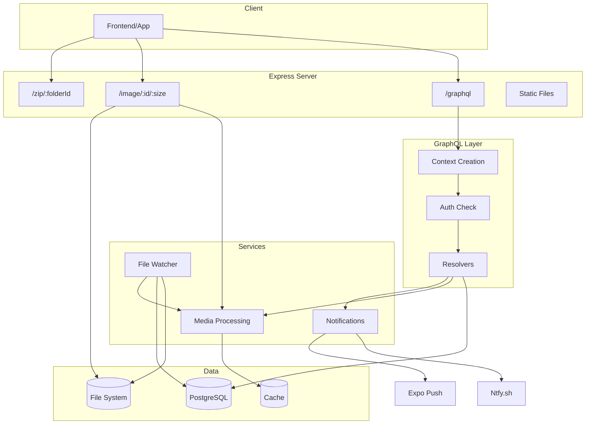
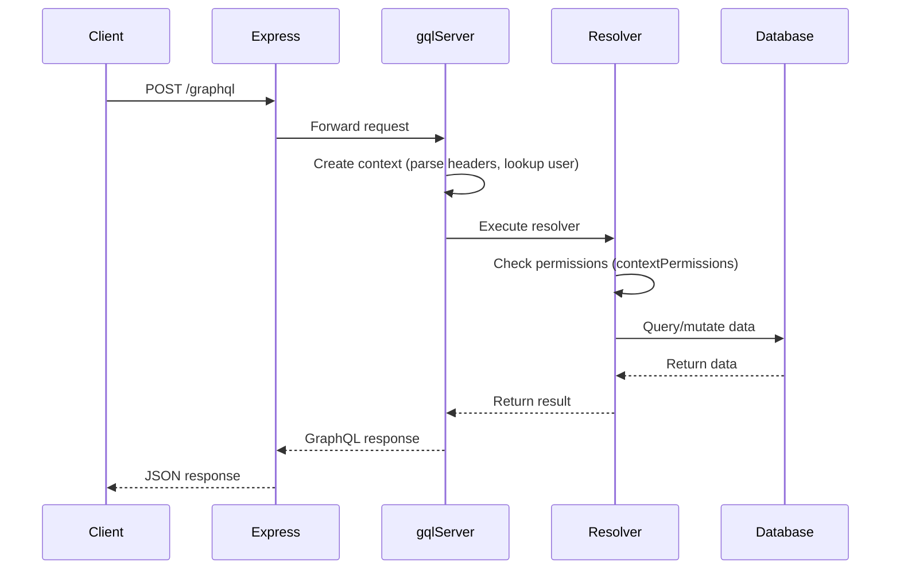
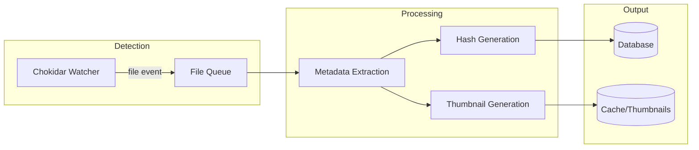
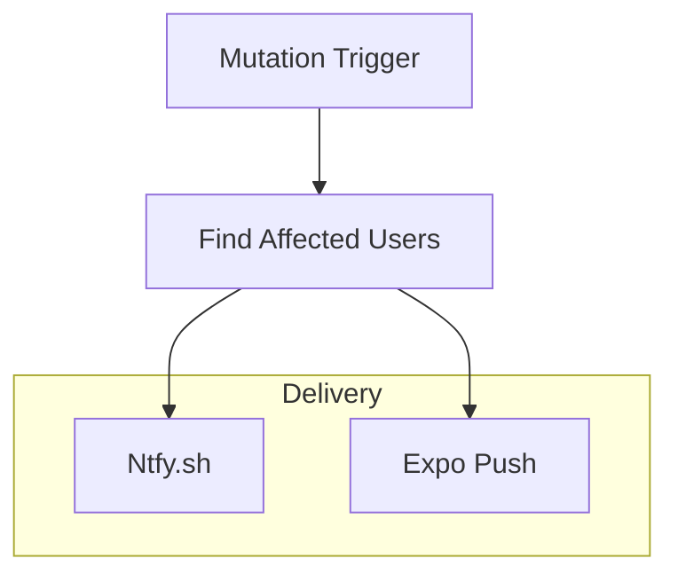

# Backend Development Guide

The backend is a Node.js/Express server providing a GraphQL API, media processing, and file system watching.

## Architecture Overview



## Directory Structure

```
backend/
├── auth/               # JWT, permissions, user lookup
├── boot/               # Startup migrations and initialization
├── config/             # Environment config with Zod validation
├── db/
│   ├── models/         # Drizzle schema definitions
│   ├── drizzle/        # Generated migrations
│   ├── picrDb.ts       # Database instance + helper queries
│   └── column.helpers.ts
├── express/            # HTTP routing and middleware
├── filesystem/         # File watcher and queue processing
│   └── events/         # File/folder event handlers
├── graphql/
│   ├── types/          # GraphQL object types
│   ├── queries/        # Query resolvers
│   ├── mutations/      # Mutation resolvers
│   ├── interfaces/     # Shared interfaces (fileInterface)
│   └── helpers/        # Auth helpers, enum conversion
├── helpers/            # Shared utilities
├── media/              # Image/video processing, thumbnails
├── notifications/      # Ntfy and Expo push notifications
├── types/              # TypeScript interfaces
└── logger.ts           # Winston logging setup
```

## Database (Drizzle ORM)

### Schema Location

All models in `db/models/`. See `database-erd.md` for the full entity relationship diagram.

### Models & Relationships

| Model             | Table         | Purpose                       |
| ----------------- | ------------- | ----------------------------- |
| `dbUser`          | Users         | Admin accounts & public links |
| `dbFolder`        | Folders       | Directory hierarchy           |
| `dbFile`          | Files         | Media files with metadata     |
| `dbComment`       | Comments      | User comments on files        |
| `dbAccessLog`     | AccessLogs    | View/download tracking        |
| `dbBranding`      | Brandings     | Custom folder theming         |
| `dbUserDevice`    | UserDevice    | Push notification devices     |
| `dbServerOptions` | ServerOptions | Global server config          |

### Enums (in `db/models/enums.ts`)

```typescript
// Pattern: options array + pgEnum
export const userTypeOptions = ['Admin', 'All', 'Link', 'User'] as const;
export const userTypeEnum = pgEnum('user_type', userTypeOptions);

// TypeScript type from options
type UserType = (typeof userTypeOptions)[number]; // 'Admin' | 'All' | 'Link' | 'User'
```

### Key Patterns

```typescript
// All tables use baseColumns (id, createdAt, updatedAt)
import { baseColumns } from '../column.helpers.js';

export const dbExample = pgTable('Examples', {
  ...baseColumns,
  name: varchar('name', { length: 255 }).notNull(),
});

// Type inference
type Example = typeof dbExample.$inferSelect;
type NewExample = typeof dbExample.$inferInsert;

// Convenience functions in picrDb.ts
const folder = await dbFolderForId(folderId); // throws if not found
const file = await dbFileForId(fileId); // throws if not found
const user = await dbUserForId(userId); // throws if not found
```

### Adding/Modifying Tables

1. Create or edit model in `db/models/`
2. Export from `db/models/index.ts` if new
3. **IMPORTANT**: AI agents must NOT run migrations directly. Prompt the user:
   ```
   Please run: cd backend && npx drizzle-kit generate --name=<suggest-a-name>
   Then review the migration in backend/db/drizzle/ and run: npx drizzle-kit migrate
   ```
4. Server auto-migrates on startup in dev mode

---

## GraphQL Server

Uses `graphql-http` (not Apollo). Schema defined programmatically with `graphql` library.

### Request Flow



### Context Structure (`PicrRequestContext`)

```typescript
interface PicrRequestContext {
  headers: {
    auth: string; // JWT token
    uuid: string; // Public link UUID
    sessionId: string; // Browser session
    userAgent: string;
    ipAddress: string;
  };
  user?: User; // Authenticated user (JWT or UUID)
  userHomeFolder?: Folder;
}
```

### Adding a New Query

```typescript
// backend/graphql/queries/myNewQuery.ts
import {
  GraphQLFieldResolver,
  GraphQLNonNull,
  GraphQLString,
  GraphQLID,
} from 'graphql';
import { PicrRequestContext } from '../../types/PicrRequestContext.js';
import { contextPermissions } from '../helpers/contextPermissions.js';

const resolver: GraphQLFieldResolver<any, PicrRequestContext> = async (
  _,
  params,
  context,
) => {
  // Check permissions (throws if denied)
  const { folder, user } = await contextPermissions(
    context,
    params.folderId,
    'View',
  );

  // Your logic here
  return { result: 'data' };
};

export const myNewQuery = {
  type: new GraphQLNonNull(GraphQLString),
  resolve: resolver,
  args: {
    folderId: { type: new GraphQLNonNull(GraphQLID) },
  },
};
```

Then add to `schema.ts`:

```typescript
import { myNewQuery } from './queries/myNewQuery.js';

const queries = {
  // ... existing queries
  myNewQuery,
};
```

### Adding a New Mutation

Same pattern, but add to `mutations` object in `schema.ts`.

### Permission Checking

```typescript
import { contextPermissions } from '../helpers/contextPermissions.js';

// Require Admin permission (throws AUTH error if denied)
const { folder, user } = await contextPermissions(context, folderId, 'Admin');

// Require View permission (Link users can access)
const { folder, user } = await contextPermissions(context, folderId, 'View');

// Optional check (returns permissions level, doesn't throw)
const { permissions } = await contextPermissions(context, folderId);
if (permissions === 'Admin') {
  /* admin-only logic */
}
```

### Auth Error Contract

When denying access from GraphQL resolvers, use `doAuthError(...)` so clients can reliably classify errors.

- `extensions.code` must be one of:
  - `UNAUTHENTICATED` for login/session problems
  - `FORBIDDEN` for permission/scope problems
  - `BAD_USER_INPUT` for auth-related invalid input
- `extensions.reason` must carry the specific machine-readable reason (for example `NOT_LOGGED_IN`, `ACCESS_DENIED`, `INVALID_LINK`)
- Avoid adding new ad-hoc auth message parsing on the client. Clients should branch on `code` + `reason`, not `message`.
- Source of truth for reason strings, default messages, and code mapping: `shared/auth/authErrorContract.ts`

### Codegen

AI agents CAN run `npm run gql` freely - it regenerates:

- `./graphql-types.ts` - TypeScript types
- `./schema.graphql` - SDL schema
- `shared/gql/*` - URQL client code
- `shared/urql/graphql.schema.json` - Schema for caching

Run after any schema changes.

---

## Authentication

### JWT Flow

```typescript
// Token generation (28-day expiry)
const token = generateToken({
  userId: user.id,
  hashedPassword: user.hashedPassword,
});

// Token validation
const payload = validateToken(token); // returns { userId, hashedPassword } or undefined

// Validates password hasn't changed since token was issued
```

### Auth Methods

1. **JWT** (Admin users): `Authorization: Bearer <token>` header
2. **UUID** (Link users): `uuid: <uuid>` header

GraphQL context creation tries JWT first, falls back to UUID.

---

## Media Processing Pipeline



### File Watcher

- Uses `chokidar` for cross-platform file watching
- Supports polling mode (for Docker/NAS via `USE_POLLING=true`)
- Ignores: `.` files, `@eaDir`, `desktop.ini`, `Thumbs.db`
- Detects renames via `renameTracker`

### Thumbnail Sizes

| Size  | Dimension | Purpose          |
| ----- | --------- | ---------------- |
| `sm`  | 250px     | Grid thumbnails  |
| `md`  | 500px     | Medium previews  |
| `lg`  | 2500px    | Full-screen view |
| `raw` | Original  | Direct download  |

### Image Processing

```typescript
// Uses sharp library
// Generates JPEG (quality 60) and optional AVIF (quality 45)
// Creates blurhash for placeholder
```

### Video Processing

```typescript
// Uses FFmpeg via fluent-ffmpeg
// Extracts 10 frames at equal intervals
// Merges into vertical montage thumbnail
// Queued to prevent concurrent FFmpeg processes
```

---

## Notifications



### Notification Types

- `viewed` - Gallery opened
- `downloaded` - File downloaded
- `rated` - File rated
- `flagged` - File flagged
- `commented` - Comment added

### Ntfy Integration

```typescript
// User has ntfy field with topic URL
// HTTP POST with headers: Title, Tags, Click, Email
```

### Expo Push

```typescript
// User devices have notificationToken
// Deep links: https:// → picr:// for app routing
// Auto-disables invalid tokens
```

---

## Express Routes

| Route                                  | Handler        | Purpose                 |
| -------------------------------------- | -------------- | ----------------------- |
| `POST /graphql`                        | `gqlServer`    | GraphQL API             |
| `GET /image/:id/:size/:hash/:filename` | `imageRequest` | Serve images/thumbnails |
| `GET /zip/:folderId/:hash/:filename`   | `zipRequest`   | Serve ZIP downloads     |
| `GET /*`                               | `picrTemplate` | SPA with OpenGraph meta |

### Image Request Flow

1. Validate file exists and hash matches
2. Check if thumbnail exists
3. Generate on-demand if missing
4. Return JPEG or AVIF based on config

### ZIP Generation

1. GraphQL mutation triggers `addToZipQueue`
2. Archives folder contents (compression level 9)
3. Stores in `cache/zip/[name]/[hash].zip`
4. Client polls for completion, then downloads

---

## Configuration

All env vars validated with Zod. See `.env.example` for full documentation.

### Required Variables

| Variable       | Description                  |
| -------------- | ---------------------------- |
| `DATABASE_URL` | PostgreSQL connection string |
| `BASE_URL`     | Server URL ending with `/`   |

### Optional Variables

| Variable           | Default      | Description                   |
| ------------------ | ------------ | ----------------------------- |
| `NODE_ENV`         | `production` | Environment mode              |
| `PORT`             | `6900`       | Server port                   |
| `USE_POLLING`      | `false`      | File watcher polling mode     |
| `POLLING_INTERVAL` | `20`         | Polling multiplier (ms × 100) |
| `DEBUG_SQL`        | `false`      | Log Drizzle queries           |
| `CONSOLE_LOGGING`  | `false`      | Winston console output        |

---

## Logging

Uses Winston with file destinations:

- `cache/error.log` - Errors only
- `cache/info.log` - All info+ messages

```typescript
import { logger } from './logger.js';

logger.info('Processing file', { filename, folderId });
logger.error('Failed to process', { error: err.message });
```

---

## Validation Commands

Run these after backend changes:

```bash
cd backend && npm run lint
cd backend && npx tsc --noEmit
cd backend && npm run build
```

Also run repo-wide formatting checks:

```bash
npm run format:check
```

For test validation, ask the user to run:

```bash
npm run workflow
```

---

## Troubleshooting

### `npm run gql` fails with network error

The dev server must be running for codegen to introspect the schema:

```bash
npm run start:server  # In one terminal
npm run gql           # In another terminal
```

### File watcher not detecting changes

1. Check `USE_POLLING=true` is set (required for Docker/NAS)
2. Increase `POLLING_INTERVAL` if system is slow
3. Check file permissions on media directory

### Thumbnails not generating

1. Check FFmpeg is installed (`ffmpeg -version`)
2. Check cache directory is writable
3. Check logs in `cache/error.log`

### Database migration issues

Never run migrations automatically. Always:

```bash
cd backend
npx drizzle-kit generate --name=<suggest-a-name> # Review the generated SQL
npx drizzle-kit migrate   # Apply after review
```

### Auth errors in GraphQL

1. Check JWT token hasn't expired (28 days)
2. Check user's password hasn't changed (invalidates token)
3. For Link users, check UUID header is being sent
4. Check user is enabled (`enabled: true`)
