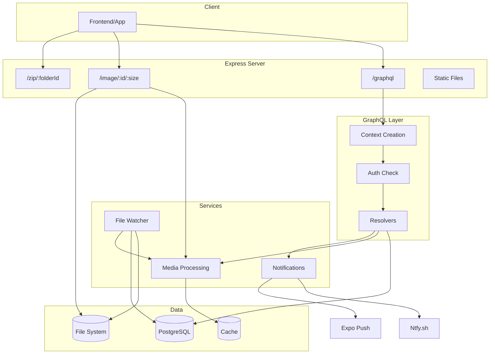
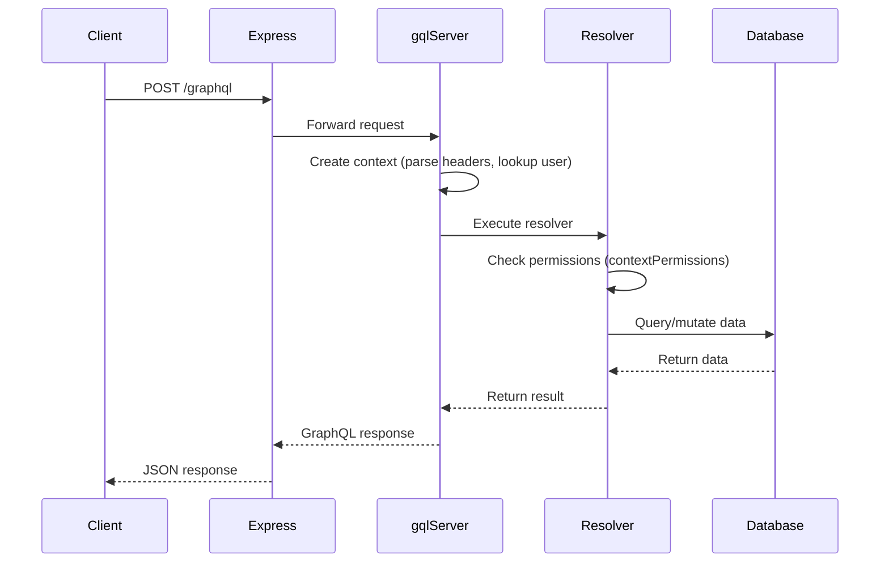
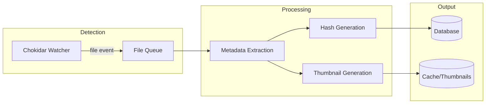
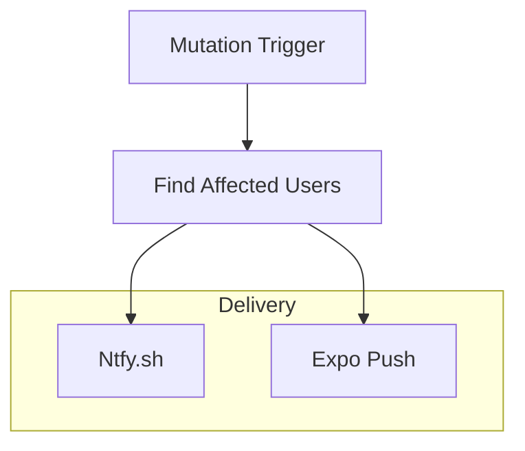

# Backend Development Guide

The backend is a Node.js/Express server providing a GraphQL API, media processing, and file system watching.

## Architecture Overview


```mermaid
flowchart TB
    subgraph Client
        FE[Frontend/App]
    end

    subgraph Express["Express Server"]
        GQL["/graphql"]
        IMG["/image/:id/:size"]
        ZIP["/zip/:folderId"]
        STATIC["Static Files"]
    end

    subgraph GraphQL["GraphQL Layer"]
        CTX[Context Creation]
        AUTH[Auth Check]
        RES[Resolvers]
    end

    subgraph Services
        MEDIA[Media Processing]
        NOTIFY[Notifications]
        WATCH[File Watcher]
    end

    subgraph Data
        DB[(PostgreSQL)]
        FS[(File System)]
        CACHE[(Cache)]
    end

    FE --> GQL
    FE --> IMG
    FE --> ZIP

    GQL --> CTX --> AUTH --> RES
    RES --> DB
    RES --> MEDIA
    RES --> NOTIFY

    IMG --> MEDIA --> CACHE
    IMG --> FS

    WATCH --> FS
    WATCH --> DB
    WATCH --> MEDIA

    NOTIFY --> NTFY[Ntfy.sh]
    NOTIFY --> EXPO[Expo Push]
```

## Directory Structure

```
backend/
├── auth/               # JWT, permissions, user lookup
├── boot/               # Startup migrations and initialization
├── config/             # Environment config with Zod validation
├── db/
│   ├── models/         # Drizzle schema definitions
│   ├── drizzle/        # Generated migrations
│   ├── picrDb.ts       # Database instance + helper queries
│   └── column.helpers.ts
├── express/            # HTTP routing and middleware
├── filesystem/         # File watcher and queue processing
│   └── events/         # File/folder event handlers
├── graphql/
│   ├── types/          # GraphQL object types
│   ├── queries/        # Query resolvers
│   ├── mutations/      # Mutation resolvers
│   ├── interfaces/     # Shared interfaces (fileInterface)
│   └── helpers/        # Auth helpers, enum conversion
├── helpers/            # Shared utilities
├── media/              # Image/video processing, thumbnails
├── notifications/      # Ntfy and Expo push notifications
├── types/              # TypeScript interfaces
└── logger.ts           # Winston logging setup
```

## Database (Drizzle ORM)

### Schema Location

All models in `db/models/`. See `database-erd.md` for the full entity relationship diagram.

### Models & Relationships

| Model             | Table         | Purpose                       |
| ----------------- | ------------- | ----------------------------- |
| `dbUser`          | Users         | Admin accounts & public links |
| `dbFolder`        | Folders       | Directory hierarchy           |
| `dbFile`          | Files         | Media files with metadata     |
| `dbComment`       | Comments      | User comments on files        |
| `dbAccessLog`     | AccessLogs    | View/download tracking        |
| `dbBranding`      | Brandings     | Custom folder theming         |
| `dbUserDevice`    | UserDevice    | Push notification devices     |
| `dbServerOptions` | ServerOptions | Global server config          |

`Folders.folderLastModified` is the folder filesystem mtime captured by folder
add/rename/rescan paths. File ingestion (`addFile`) does not currently update
the parent folder's `folderLastModified`, so UI sorting by folder "Modified"
does not necessarily mean "newest child media inside this folder".

Access log writes are awaited by folder view and ZIP download resolvers. Treat
request-derived metadata such as User-Agent, session IDs, and forwarded IP
headers as untrusted/variable length; database length errors here can block
gallery access, not just analytics.

`createAccessLog()` is short-circuited at the top when `DISABLE_ACCESS_LOGS=true`,
which suppresses view/download access-log rows. Existing rows are not deleted by
the flag — set it only via env, not via any UI mutation. Public-link view
notifications are sent from `recordFolderVisit`, and download notifications are
sent from `generateZip` after a download row is written.

Active `Image` rows are expected to have positive oriented `imageWidth` and
`imageHeight` values. The columns are nullable because non-image rows do not use
them and because Drizzle SQL migrations run before PICR's boot backfill, but
missing image dimensions are not normal runtime state. Populate dimensions in
the same decode/metadata path that classifies an image. Post-boot dimension
backfill is repair work: if an existing image cannot be decoded there, log/count
the failure and leave the row unchanged so a flaky mount or transient decoder
failure does not rewrite user-visible media state. Let normal file scanning
handle durable type changes. Do not spread nullable-dimension handling into
gallery code or thumbnail selection.

Folder rows can be `exists=false` while `existsRescan=true` after a watcher
delete, because `removeFolder()` archives the row without clearing
`existsRescan`. `addFolder()` must reactivate rows when either flag is false;
otherwise a scan can return that archived folder id and immediately fail through
`dbFolderForId()`, which filters to active folders. `addFile()` folder lookup
should also ignore archived folder rows so it falls through to `addFolder()` for
reactivation.

The dashboard "Recent Clients" card is backed by `Users.lastAccess`, while the
full access-log view reads `AccessLogs`. Public-link view notifications and
`lastAccess` are driven by `recordFolderVisit`, which uses a 30-minute real-visit
clock; `Query.folder` only writes foreground-gated per-folder access-log rows.
Downloads remain real actions and update logs, notifications, and `lastAccess`.
`Query.me` must not update `lastAccess` for Link users, because that would let a
cached/client bootstrap query change the dashboard timestamp without the matching
visit notification.

### Enums (in `db/models/enums.ts`)

```typescript
// Pattern: options array + pgEnum
export const userTypeOptions = ['Admin', 'All', 'Link', 'User'] as const;
export const userTypeEnum = pgEnum('user_type', userTypeOptions);

// TypeScript type from options
type UserType = (typeof userTypeOptions)[number]; // 'Admin' | 'All' | 'Link' | 'User'
```

### Key Patterns

```typescript
// All tables use baseColumns (id, createdAt, updatedAt)
import { baseColumns } from '../column.helpers.js';

export const dbExample = pgTable('Examples', {
  ...baseColumns,
  name: varchar('name', { length: 255 }).notNull(),
});

// Type inference
type Example = typeof dbExample.$inferSelect;
type NewExample = typeof dbExample.$inferInsert;

// Convenience functions in picrDb.ts
const folder = await dbFolderForId(folderId); // throws if not found
const file = await dbFileForId(fileId); // throws if not found
const user = await dbUserForId(userId); // throws if not found
```

### Adding/Modifying Tables

1. Create or edit model in `db/models/`
2. Export from `db/models/index.ts` if new
3. **Generate the migration** by running:

   ```bash
   cd backend && MIGRATION_NAME=<descriptive-name> npm run dk:generate
   ```

   drizzle-kit diffs the schema against existing migrations and writes the SQL file to `db/drizzle/`. **Never hand-write migration SQL files** — the generated output includes statement-breakpoint annotations and journal metadata that manual files will be missing.

   If the command fails (e.g. DB not reachable), tell the user to run it themselves rather than creating the file manually.

4. Server auto-migrates on startup (dev and production)

---

### Boot Migration Phases

`schemaMigration()` and `dbMigrate()` run before Express listens. Keep only
work there that must finish before serving traffic: schema changes, compatibility
guards, token-secret setup, and structural data repairs where users could
otherwise interact with rows that are about to be merged or reclassified. The
Docker healthcheck hits `/readyz`, which is only reachable after Express starts;
slow pre-listen work can make an otherwise healthy container look failed.

Use `postBootMaintenance()` for resumable derived-data repair where serving
before completion means stale data, not wrong behavior. Run it after
`express.listen()` and shutdown-handler registration, but before `fileWatcher()`
and scheduled scans unless a task has a proven reason to run concurrently with
that boot/watch/scheduled scanner work. Express is already accepting traffic at
this point, so request-triggered work such as on-view scans may still overlap.
Deferred maintenance must catch/log its own top-level failures and continue
startup so stale derived data does not take the server down after it is already
listening. Maintenance tasks that actually do work should leave a concise
info-level stdout trail for production operators: start, completion with elapsed
time and affected row/file counts where applicable, and failure summaries that
explain what was left stale. Keep no-op maintenance quiet so routine boots do
not accumulate noise in long-lived server logs.

`lastBootedVersion` is stamped at the end of `dbMigrate()`, before
post-boot maintenance runs. Post-boot tasks may read the previous booted version
for logging or fresh-install shortcuts, but required completion must be gated by
durable data state or by a task-specific durable marker. If a task can only be
made safe with the global version gate, keep it pre-listen.

---

## GraphQL Server

Uses `graphql-http` (not Apollo). Schema defined programmatically with `graphql` library.

GraphQL enum fields do not always imply Postgres enum columns. For user-facing
layout settings that may gain options later, keep the DB column as `varchar`
when flexibility matters, expose a `GraphQLEnumType` at the API boundary, and
normalize legacy/invalid stored strings in the object field resolver so enum
serialization cannot fail.

### Request Flow


```mermaid
sequenceDiagram
    participant C as Client
    participant E as Express
    participant G as gqlServer
    participant R as Resolver
    participant D as Database

    C->>E: POST /graphql
    E->>G: Forward request
    G->>G: Create context (parse headers, lookup user)
    G->>R: Execute resolver
    R->>R: Check permissions (contextPermissions)
    R->>D: Query/mutate data
    D-->>R: Return data
    R-->>G: Return result
    G-->>E: GraphQL response
    E-->>C: JSON response
```

### Release Update Lookup

`backend/helpers/latestBuild.ts` checks GitHub releases for the newest PICR
version. GitHub/API failures return an empty string when there is no stale cache;
that means "unknown", not "update available". Keep release tags normalized to
semver before caching/comparing them so values like `v1.2.2` and `1.2.2` are
treated as the same release, and skip prerelease tags (e.g. `1.3.0-beta.1`) when
selecting the latest release so a prerelease is never surfaced as an update. The
Settings page polls `serverInfo` regularly, so
that resolver should use the normal cached lookup instead of force-refreshing
GitHub on every request.

### User Avatars

User JSON keeps the nullable `gravatar` field for GraphQL/client compatibility,
and `backend/graphql/helpers/userToJSON.ts` builds Gravatar URLs in-house from
email-like usernames. Keep this dependency-free and follow Gravatar's current
identifier rules: trim the email, lowercase it, then SHA256 hash it. Do not
reintroduce the `gravatar` npm package or MD5-based Gravatar URLs; the package
pulls stale transitive dependencies and MD5 email hashes are easier to reverse.

### Server Folder Size

`serverInfo.cacheSize` and `serverInfo.mediaSize` use
`backend/helpers/folderSize.ts`, which shells out to `du` on Linux/macOS and
falls back to a local filesystem walk if unavailable. Keep this in-house rather
than reintroducing `fast-folder-size`: that package pulls archive-download and
extraction dependencies that are unrelated to calculating folder sizes.

### ZIP Extraction

The benchmark asset setup uses `backend/helpers/extractZip.ts`, a small ZIP-only
extractor around `yauzl`, instead of broad archive extraction packages. Keep it
policy-controlled: validate paths after any strip-components handling, stream
file entries, and reject symlinks/special entries. Do not reuse it for user
uploads without adding explicit upload limits and a fresh threat model.

### Benchmark Timing

`backend/benchmark/runBenchmark.ts` reports step timings intended for production
performance decisions. Keep setup, output directory cleanup, recursive output
size scans, and other bookkeeping outside each step's measured `ms`; otherwise
steps that write more files are penalized by measurement overhead rather than
media-processing work. Local asset overrides must stay under
`picrConfig.mediaPath`, and real-media benchmark steps should count per-file
failures instead of aborting the whole run on the first corrupt file. When a
benchmark row is labelled as current image production, keep its Sharp pipeline
aligned with `backend/media/encodeImageThumbnails.ts`; label old comparison rows
as historical/pre-R0. Video poster rows still align with
`backend/media/encodeThumbnail.ts`.

### FFmpeg/FFprobe Configuration

- Use `backend/media/ffmpeg.ts` for ffmpeg/ffprobe calls. It runs the configured
  binaries from `picrConfig.ffmpegPath ?? 'ffmpeg'` and
  `picrConfig.ffprobePath ?? 'ffprobe'`, accepts explicit argument arrays, and
  applies timeouts. Some self-hosted installs set `FFPROBE_PATH` because
  `ffprobe` is not on `PATH`; do not shell out to raw `ffprobe` without the
  wrapper.

### Hardware Video Acceleration (VAAPI)

- The resolved acceleration status lives on `picrConfig`
  (`videoAccelerationMode` = `'cpu' | 'vaapi'`, plus `videoAccelerationReason`,
  `videoAccelerationDriver`, `videoAccelerationCodecs`). It is set once at boot
  by `backend/boot/detectVideoAcceleration.ts`. The authority is a tiny ffmpeg
  VAAPI smoke pipeline (proves ffmpeg can run `scale_vaapi` on the device);
  `vainfo` only enriches the driver/codec display. Never re-probe per request;
  read the config instead.
- Detection and every accelerated media operation must be **non-fatal**: VAAPI
  failure falls back to CPU, never `process.exit`. Gate VAAPI ffmpeg paths on
  `picrConfig.videoAccelerationMode === 'vaapi'` and retry the file on CPU if
  the hardware path throws (see the benchmark for the pattern).
- VAAPI drivers ship in the `amd64` Docker image only; `arm64` has no drivers
  and always resolves to CPU. Anything that runs ffmpeg VAAPI filters must
  therefore tolerate the drivers being absent.
- **Production video thumbnails are intentionally CPU-only.** VAAPI benchmarked
  ~16-19% slower than CPU for seek-based poster/scrub extraction (GPU
  upload/download overhead dominates), so `generateVideoThumbnail.ts` does not
  use VAAPI. The VAAPI thumbnail helper (`media/vaapiVideo.ts`,
  `extractVaapiThumbnailFrames`) is benchmark/reference-only. VAAPI is retained
  because it is ~2.5-2.9x faster for whole-video transcode — groundwork for a
  future transcoding feature. Don't wire VAAPI into the thumbnail path without
  re-benchmarking.

### Media Write Access

- Treat effective file operations as the source of truth for media write access.
  NAS setups, especially Synology over NFS, can expose POSIX mode bits or
  `fs.access` results that do not match DSM ACL behavior. Use the hidden-file
  write probe in `backend/config/mediaWriteAccess.ts` instead of adding new
  ownership/mode-bit or `fs.accessSync(W_OK)` gates.
- `CAN_WRITE=false` must remain a pure opt-out: do not create probe files or
  perform any other media write attempts when it is disabled.

### Filesystem Stat Precision

- `scanFolder` reads inodes with `stat(path, { bigint: true })`, but PICR's
  content hashes intentionally match normal `fs.Stats` `Date#getTime()`
  semantics. If you derive runtime stats from `BigIntStats`, round
  `mtimeNs`/`birthtimeNs` to milliseconds the same way `fileStatsFromBigIntStats`
  does before calling `contentHashForStats`; raw nanosecond or truncated
  millisecond values can break move detection against existing database rows.
- `Files.fileCreated` is sourced from filesystem birth time (`stats.birthtime` /
  `birthtimeNs`), not EXIF/photo metadata. Some mounted or virtual filesystems
  do not expose creation time to Node and may report Unix epoch instead. Treat
  `1970-01-01T00:00:00.000Z` as "birth time unavailable" rather than a real
  media creation date.

### Context Structure (`PicrRequestContext`)

```typescript
interface PicrRequestContext {
  headers: {
    auth: string; // JWT token
    uuid: string; // Public link UUID
    sessionId: string; // Browser session
    userAgent: string;
    ipAddress: string;
  };
  user?: User; // Authenticated user (JWT or UUID)
  userHomeFolder?: Folder;
  scanFolderIds?: Set<number>; // Viewed folders to scan after the GraphQL response finishes
}
```

### Adding a New Query

```typescript
// backend/graphql/queries/myNewQuery.ts
import {
  GraphQLFieldResolver,
  GraphQLNonNull,
  GraphQLString,
  GraphQLID,
} from 'graphql';
import { PicrRequestContext } from '../../types/PicrRequestContext.js';
import { contextPermissions } from '../helpers/contextPermissions.js';

const resolver: GraphQLFieldResolver<any, PicrRequestContext> = async (
  _,
  params,
  context,
) => {
  // Check permissions (throws if denied)
  const { folder, user } = await contextPermissions(
    context,
    params.folderId,
    'View',
  );

  // Your logic here
  return { result: 'data' };
};

export const myNewQuery = {
  type: new GraphQLNonNull(GraphQLString),
  resolve: resolver,
  args: {
    folderId: { type: new GraphQLNonNull(GraphQLID) },
  },
};
```

Then add to `schema.ts`:

```typescript
import { myNewQuery } from './queries/myNewQuery.js';

const queries = {
  // ... existing queries
  myNewQuery,
};
```

### Adding a New Mutation

Same pattern, but add to `mutations` object in `schema.ts`.

### Mutation Resolver Args Types

Resolvers use `Mutation*Args` from `@shared/gql/graphql.js` for their args type:

```typescript
import type { MutationEditFolderArgs } from '@shared/gql/graphql.js';
type EditFolderArgs = MutationEditFolderArgs;
```

After adding new args to a mutation, run `npm run gql` to regenerate the types before continuing. If the server is not running, ask the user to start it and run `npm run gql`. Never use local type extensions or any other workaround to avoid this step.

### Permission Checking

```typescript
import { contextPermissions } from '../helpers/contextPermissions.js';

// Require Admin permission (throws AUTH error if denied)
const { folder, user } = await contextPermissions(context, folderId, 'Admin');

// Require View permission (Link users can access)
const { folder, user } = await contextPermissions(context, folderId, 'View');

// Optional check (returns permissions level, doesn't throw)
const { permissions } = await contextPermissions(context, folderId);
if (permissions === 'Admin') {
  /* admin-only logic */
}
```

### Auth Error Contract

When denying access from GraphQL resolvers, use `doAuthError(...)` so clients can reliably classify errors.

- `extensions.code` must be one of:
  - `UNAUTHENTICATED` for login/session problems
  - `FORBIDDEN` for permission/scope problems
  - `BAD_USER_INPUT` for auth-related invalid input
- `extensions.reason` must carry the specific machine-readable reason (for example `NOT_LOGGED_IN`, `ACCESS_DENIED`, `INVALID_LINK`)
- Avoid adding new ad-hoc auth message parsing on the client. Clients should branch on `code` + `reason`, not `message`.
- Source of truth for reason strings, default messages, and code mapping: `shared/auth/authErrorContract.ts`

### Codegen

AI agents CAN run `npm run gql` freely - it regenerates:

- `shared/gql/*` - TypeScript GraphQL types/documents
- `./schema.graphql` - SDL schema
- `shared/urql/graphql.schema.json` - Schema for caching

Run after any schema changes. Codegen imports and validates the executable
schema in-process and writes a temporary introspection snapshot under
`.scratch/`; it does not require the backend server or database to be running.

Codegen is offline but not yet bootstrappable from scratch. Around 36 backend
files import `@shared/gql/graphql`, and several import runtime _values_ rather
than types (`FileType`, `FoldersSortType`, `UserType`, `AccessType`,
`LinkMode`). Because that module is generated client output, schema
construction depends on the previous codegen result, so `npm run gql` cannot
recover from an empty `shared/gql/`. Those files are tracked, so this is not a
problem in practice.

Prefer not to add new backend imports from `@shared/gql/graphql`; define
canonical domain types and values in backend or non-generated shared modules
instead. This is currently a convention rather than a lint rule - enforcing it
means encoding the existing 36-file exception list, which is deferred until the
values are migrated.

---

## Authentication

### JWT Flow

```typescript
// Token generation (28-day expiry)
const token = generateToken({
  userId: user.id,
  hashedPassword: user.hashedPassword,
});

// Token validation
const payload = validateToken(token); // returns { userId, hashedPassword } or undefined

// Validates password hasn't changed since token was issued
```

### Auth Methods

1. **JWT** (Admin users): `Authorization: Bearer <token>` header
2. **UUID** (Link users): `uuid: <uuid>` header

GraphQL context records both the effective principal and any structured
public-link attempt. A valid JWT always wins. An invalid or expired JWT falls
through to a valid UUID, matching the historical authentication order. Rejected
UUID attempts retain their internal reason so permissions do not infer auth
provenance from raw header presence. `publicLinkInfo` must consume this
request-level result rather than querying the link user independently.

Keep the required `publicLinkInfo(uuid:)` argument while URQL/Graphcache keys
the root query by its arguments. The web client sends the same UUID in the
header and argument: the header drives authentication, while the argument gives
the cached root field per-link identity and makes route changes reexecute. The
resolver may use the consolidated lookup service for argument-only 1.x callers,
but must not duplicate the normal header lookup.

Only public-safe link states cross the GraphQL boundary. Missing, disabled,
deleted, and wrong-user-type rows all map to `UNAVAILABLE`; `EXPIRED` is
deliberately distinct so a link holder gets an actionable message.
Keep the status classifier in `auth/publicLinkAuth.ts` pure; database and folder
lookup belong in `auth/publicLinkAttempt.ts`. This makes rejection precedence
directly testable without mocking Drizzle or database modules.

---

## Media Processing Pipeline


```mermaid
flowchart LR
    subgraph Detection
        CHOK[Chokidar Watcher]
        QUEUE[File Queue]
    end

    subgraph Processing
        META[Metadata Extraction]
        THUMB[Thumbnail Generation]
        HASH[Hash Generation]
    end

    subgraph Output
        DB[(Database)]
        CACHE[(Cache/Thumbnails)]
    end

    CHOK -->|file event| QUEUE
    QUEUE --> META
    META --> HASH
    META --> THUMB
    HASH --> DB
    THUMB --> CACHE
```

### File Watcher

See `docs/development/media-scanning.md` for the full scanning model and the
contracts between watcher, on-view, scheduled, and manual scans.

- Uses `chokidar` for cross-platform file watching
- Supports `FILE_WATCHER=native|polling|off`; legacy `USE_POLLING=true`
  still maps to polling mode for existing installs
- `ON_VIEW_SCAN` is stale-while-revalidate: the `folder` query records viewed
  folder IDs on `PicrRequestContext.scanFolderIds`, and the Express GraphQL
  wrapper drains them from `res.on('finish')`. Do not run filesystem scans
  inline in resolvers; gallery responses must return from the DB/cache first.
- `scanFolder()` serializes by actual `folderId`. Keep this below the caller
  layer: parent-folder on-view scans can recurse into pending child folders, and
  frontend polling can request a direct scan of that same child at the same time.
- `addFolder()` serializes creation/reactivation per relative folder path.
  `addFile()` can call it while resolving a missing parent folder, so do not rely
  only on scan-folder or file-queue serialization to prevent duplicate folder
  rows.
- `addFile()` queues thumbnail generation only after the `Files` row has been
  persisted with `exists=true` and the current `fileHash`. Do not move that
  enqueue earlier: thumbnail workers resolve rows through `dbFileForId()`, which
  filters to active rows and uses the persisted hash for cache paths.
  Thumbnail-generation failures must stay isolated from row persistence; they
  should not downgrade an image to a generic file or prevent a video row from
  receiving its latest hash/existence flags.
- Image thumbnail generation is single-flight by `file.id`, `fileHash`, and
  size. Keep request-time cache-miss generation and queue-worker generation
  joined on the same promise; duplicate writes waste the thumbnail worker pool
  even though `atomicWrite()` prevents partial-file corruption.
- `fileQueue` runs only adjacent `generateThumbnails` items concurrently, using
  `picrConfig.thumbnailWorkerCount`. Filesystem mutation actions (`add`,
  `unlink`, `renameDir`, etc.) remain serial and must not be batched across.
- `UV_THREADPOOL_SIZE` must be set before Node starts. The Docker image sets it
  with `ENV`; assigning `process.env.UV_THREADPOOL_SIZE` inside app code is too
  late once any import has touched libuv/Sharp.
- Recursive scanner calls carry a visited-folder set. If corrupt `parentId`
  data creates a folder cycle, skip the repeated folder and log a warning;
  waiting on the per-folder lock from the same scan stack would deadlock.
- `SCHEDULED_SCAN_HOURS` runs an in-process whole-library reconcile backstop.
  It skips overlapping ticks and queues thumbnail generation only when the
  scheduled run's new-file count is within `SCHEDULED_SCAN_THUMB_LIMIT`.
- Ignores: `.` files, `@eaDir`, `desktop.ini`, `Thumbs.db`
- Detects renames via `renameTracker`

PICR Ping registers authenticated inbound integration routes under `/api` only
when their env-backed credential is configured. Keep the JSON `/api` 404 guard
before the frontend catch-all: otherwise an unsupported integration request is
answered with the SPA HTML and looks successful to the caller. Authentication
for Ping must run before its route-local JSON parser, so an unauthenticated
client cannot make PICR parse a large request body.

Ping hints go through `pingScanCoordinator.ts`, not through watcher events. The
coordinator discovery-scans with removals disabled until the whole active batch
settles, then runs one cleanup pass. Thumbnail selection is scoped by the actual
scan-root path rather than the hinted path because an ancestor scan can discover
multiple new siblings. Recursive reconcile jobs retain their requested scope so
resolution through a missing ancestor cannot expand into unrelated siblings.
Unavailable scan roots are incomplete coverage: retry and degrade them rather
than recording a successful reconcile that could suppress a later startup
repair. A skipped individual entry is different: `unreadableNames` already
protects its row from cleanup, so keep `skippedEntries` diagnostic and let the
rest of the tree complete. Ping retry backoff is request-local; fresh hints must
run immediately rather than joining or waiting behind a degraded retry cycle.

On-view scans are metadata-first and enqueue touched thumbnails as priority
work after each pass. They perform at most one delayed settle retry. Keep the
per-folder in-flight lock around both passes and the delay so concurrent views
cannot start a duplicate operation. Large on-view priority batches make the
queue's accepted linear priority insertion and normal-work delay easier to
reach; change the queue structure only with profiling evidence.

Logical scan orchestrators must wrap their complete lifecycle in
`withMediaScanActivity()`, including resolution, settle delays, and cleanup. The
current boundaries are `scanFolderTree()`, the full Ping coordinator cycle, and
the complete on-view operation. New orchestrators must opt in at the same level;
do not expose individual low-level `scanFolder()` calls as UI tasks. Keep the
wrapper API `try`/`finally`-owned rather than adding manually paired
start/finish calls. Activity age is tracked per operation so overlapping fast
probes cannot collectively trip the UI threshold.

### Thumbnail Sizes

| Size  | Dimension                                | Purpose          |
| ----- | ---------------------------------------- | ---------------- |
| `sm`  | Default 250px, configurable server-wide  | Grid thumbnails  |
| `md`  | Default 500px, configurable server-wide  | Medium previews  |
| `lg`  | Default 2500px, configurable server-wide | Full-screen view |
| `raw` | Original                                 | Direct download  |

Thumbnail dimensions and JPEG quality are stored on the singleton
`ServerOptions` row. The disk cache filename is still tier-based (`sm`/`md`/`lg`)
rather than config-keyed, so changing media settings affects only newly generated
or regenerated thumbnails. Existing cache files continue to be served until they
are deleted, regenerated, or the source media hash changes.

### Image Processing

```typescript
// Uses sharp library
// Generates JPEG with the ServerOptions quality setting
// Creates blurhash for placeholder
```

- RAW, PSD/PSB, and HEIC/HEIF support is capability-gated at boot by
  `checkOptionalMediaTools()`. Unsupported decoded formats must remain
  `FileType.File` so they stay downloadable without broken image previews.
- `ensureDecodedImage()` is the only backend path that shells out to optional
  image decoders. It returns the original path for sharp-readable formats and a
  validated cached JPEG in `cache/thumbs/<relativePath>/` for decoded formats.
  External decoder calls must use argument arrays, timeouts, temp files, and
  sharp metadata validation before rename.
- Existing decoded cache hits are trusted by existence, like generated
  thumbnails. New decoded intermediates must be validated before the atomic
  rename into the cache.
- `addFile()` uses a `typeChanged` gate so existing files reclassify during the
  normal boot scan when optional decoder capabilities appear. Do not bulk-clear
  `fileHash` to force this.
- Image thumbnail generation decodes each source once, auto-orients pixels with
  Sharp `.rotate()`, converts to sRGB, strips EXIF/XMP, and writes a web-friendly
  sRGB ICC profile. Do not reintroduce per-size source opens or metadata-carried
  orientation without re-benchmarking and revisiting stored source dimensions.
- Image blurhash generation first tries an embedded EXIF IFD1 JPEG preview and
  falls back to the full image when the preview is absent, corrupt, non-JPEG,
  has a mismatched aspect ratio, or comes from a source with a rotating EXIF
  orientation. EXIF thumbnail offsets are relative to the TIFF header inside
  Sharp's `Exif\0\0` buffer, so production parsing adds the 6-byte EXIF prefix
  before slicing preview bytes. Any preview optimization must keep a
  full-decode fallback because Lightroom/camera previews can be missing or stale.
- Blurhashes auto-orient so the placeholder matches the pre-rotated thumbnail and
  the oriented `imageRatio` it is drawn into. An extracted IFD1 preview is a bare
  JPEG stream carrying no EXIF of its own, so `.rotate()` cannot orient it — that
  is why rotated sources are refused a preview rather than rotated after
  extraction. Adding `.rotate()` without that refusal makes the stored hash
  depend on whether a preview happened to exist, which is worse than not
  rotating at all. Committed fixtures are all orientation 1, so a rotated
  fixture is needed to cover this end to end.
- Legacy pre-v2 video montage cache directories can contain non-PICR metadata
  directories from NAS filesystems (for example Synology `@eaDir`). New video
  thumbnails are versioned files, but cleanup/rename code still sees old
  directories during transition and must handle nested directories rather than
  assuming flat image files.
- Image thumbnail writes must retain unique same-directory temporary files and
  atomic rename promotion. Metadata-first scans let the HTTP request path and
  background queue encode the same cache artifact concurrently; duplicate CPU
  work is acceptable, but a partially written JPEG/AVIF must never be visible.

### Video Processing

```typescript
// Uses backend/media/ffmpeg.ts with explicit ffmpeg/ffprobe argument arrays
// Extracts 10 candidate frames away from the exact start/end
// Picks a poster frame, writes versioned sm/md/lg poster files, and writes a scrub sprite
// Stores video imageRatio + blurHash for poster placeholders and folder heroes
// Uses a single-flight queue to prevent duplicate concurrent generation per video
// Writes poster/scrub cache artifacts atomically via temp-file rename promotion
```

- Video poster files are named
  `<name>-v${VIDEO_THUMBNAIL_CACHE_VERSION}-<size>-<hash>.jpg`. The scrub sprite is JPEG-only:
  `<name>-v${VIDEO_THUMBNAIL_CACHE_VERSION}-scrub-<hash>.jpg`.
- Client poster URLs use the normal `/image/:id/:size/:hash/poster.jpg` path
  for `sm`/`md`/`lg`. The scrub sprite is served by the backend-local
  `/image/:id/scrub/:hash/scrub.jpg` token; do not add `scrub` to shared
  `ThumbnailSize`/`allSizes`.
- New video thumbnail generation does not write legacy
  `<name>-md-<hash>.<ext>/joined.jpg` montage directories. Rename/delete cleanup
  still includes those pre-v2 directories as transitional variants, and they can
  be manually deleted from the cache; posters regenerate lazily on first
  request.
- `Files.blurHash` is nullable in the database and GraphQL schema. Existing rows
  can lack placeholders, and videos receive blur hashes lazily from generated
  poster frames.

---

## Notifications


```mermaid
flowchart TB
    TRIGGER[Mutation Trigger]
    FIND[Find Affected Users]

    subgraph Delivery
        NTFY[Ntfy.sh]
        EXPO[Expo Push]
    end

    TRIGGER --> FIND
    FIND --> NTFY
    FIND --> EXPO
```

### Notification Types

- `viewed` - Gallery opened
- `downloaded` - File downloaded
- `rated` - File rated
- `flagged` - File flagged
- `commented` - Comment added

### Ntfy Integration

```typescript
// User has ntfy field with topic URL
// HTTP POST with headers: Title, Tags, Click, Email
```

- Node's Fetch implementation only accepts ByteString HTTP header values. Encode
  non-ASCII ntfy header values as RFC 2047 UTF-8 encoded words; keep UTF-8
  notification messages in the request body.
- Ntfy delivery is best-effort. Log request and non-success response failures
  without including the topic URL, and do not fail the originating gallery
  action.

### Expo Push

```typescript
// User devices have notificationToken
// Deep links: https:// → picr:// for app routing
// Auto-disables invalid tokens
```

---

## Express Routes

| Route                                  | Handler        | Purpose                 |
| -------------------------------------- | -------------- | ----------------------- |
| `POST /graphql`                        | `gqlServer`    | GraphQL API             |
| `GET /image/:id/:size/:hash/:filename` | `imageRequest` | Serve images/thumbnails |
| `GET /zip/:folderId/:hash/:filename`   | `zipRequest`   | Serve ZIP downloads     |
| `GET /*`                               | `picrTemplate` | SPA with OpenGraph meta |

Authenticated inbound integrations use the `/api` namespace and return JSON
errors. When an integration is disabled, do not register its route. Keep a
`router.use('/api', ...)` JSON `404` guard before the unconditional
`picrTemplate` SPA fallback; without it, an unknown `POST /api/*` can return the
frontend HTML with status `200` and look like a successful integration call.

The global `compression` middleware is registered before every route so
compressible frontend assets, HTML, and API responses negotiate Brotli/gzip
without special handling in each route. It uses MIME-based filtering, so JPEG,
AVIF, video, and ZIP responses are not recompressed. Keep compression ahead of
`express.static` and `picrTemplate`; moving it below either silently restores
uncompressed frontend payloads.

### Image Request Flow

1. Validate file exists and hash matches
2. Check if thumbnail exists
3. Generate on-demand if missing
4. Return JPEG thumbnail/poster

Generated thumbnail/poster responses use a one-hour `Cache-Control` TTL with
revalidation, not year-long immutable caching, because regenerated cache files can
change bytes without changing the URL. Raw originals remain content-addressed by
`fileHash` and can keep long immutable caching.

### ZIP Generation

1. GraphQL mutation triggers `addToZipQueue`
2. Archives folder contents (compression level 9)
3. Stores in `cache/zip/[name]/[hash].zip`
4. Client polls for completion, then downloads

---

## Configuration

All env vars validated with Zod. See `.env.example` for full documentation.

When changing `backend/config/*`, Docker `ARG`/`ENV` wiring, or startup code that reads env vars:

- Validate both shapes of "optional" env vars: truly unset and present-but-empty (`''`).
- Remember that Docker can turn missing build args into empty env strings when they are forwarded through `ENV`.
- Do not stop at lint/typecheck. Rebuild the compiled backend and run `npm run test:api` so the Dockerized runtime path is exercised.

### Required Variables

| Variable       | Description                  |
| -------------- | ---------------------------- |
| `DATABASE_URL` | PostgreSQL connection string |
| `BASE_URL`     | Server URL ending with `/`   |

### Optional Variables

| Variable               | Default      | Description                                     |
| ---------------------- | ------------ | ----------------------------------------------- |
| `NODE_ENV`             | `production` | Environment mode                                |
| `PORT`                 | `6900`       | Server port                                     |
| `FILE_WATCHER`         | `native`     | `native`, `polling`, or `off` media detection   |
| `USE_POLLING`          | `false`      | File watcher polling mode                       |
| `POLLING_SECONDS`      | `20`         | Polling interval in real seconds                |
| `POLLING_INTERVAL`     | unset        | Legacy 100ms polling units, converted `/10`     |
| `ON_VIEW_SCAN`         | `off`        | Demand-driven scan mode for viewed folders      |
| `SCHEDULED_SCAN_HOURS` | `0`          | Whole-library reconcile interval, `0` disables  |
| `DEBUG_SQL`            | `false`      | Log Drizzle queries                             |
| `CONSOLE_LOGGING`      | `false`      | Winston console output                          |
| `DISABLE_ACCESS_LOGS`  | `false`      | Skip AccessLog rows + folder-view notifications |

---

## Logging

Uses Winston with file destinations:

- `cache/error.log` - Errors only
- `cache/info.log` - All info+ messages

```typescript
import { logger, log } from './logger.js';

logger.info('Processing file', { filename, folderId });
logger.error('Failed to process', { error: err.message });

// Use this for startup/boot messages that must appear in Docker/container logs
log('info', 'Server started', true);
```

### Logging Policy

- Do not add new `console.*` calls in backend runtime code.
- Use `logger.*` for normal operational and error logging.
- Use `log(level, message, true)` for boot/startup/migration messages that must be visible in terminal output (`docker logs`).
- For temporary developer traces while debugging, prefer commented-out logs or `log('debug', ...)` and remove before merging.

---

## Validation Commands

Run these after backend changes:

```bash
cd backend && npm run lint
cd backend && npx tsc --noEmit
cd backend && npm run build
```

If the change affects config/env parsing, Docker runtime behavior, boot/startup, or compiled `dist` behavior, also run:

```bash
npm run test:api
```

Also run repo-wide formatting checks:

```bash
npm run format:check
```

For test validation, ask the user to run:

```bash
npm run workflow
```

---

## Troubleshooting

### `npm run gql` fails with network error

The dev server must be running for codegen to introspect the schema:

```bash
npm run start:server  # In one terminal
npm run gql           # In another terminal
```

### `npm run gql` succeeds but generated files don't include new fields

Codegen introspects the **live server** at `http://localhost:6900/graphql`. If a
server was already running before your schema changes (e.g. a previous `npm start`
session that wasn't fully killed), that old process will still be on port 6900 and
codegen will silently introspect the stale schema.

Fix:

1. Kill **all** running server processes — check for any leftover `node` processes
   on port 6900: `lsof -ti:6900 | xargs kill -9`
2. Run `npm start` fresh and wait until you see the PICR startup banner in the
   output (confirms the new server is up and compiled code is loaded)
3. Verify the new fields are live before running codegen:
   ```bash
   curl -s -X POST http://localhost:6900/graphql \
     -H "Content-Type: application/json" \
     -d '{"query":"{ __type(name: \"Branding\") { fields { name } } }"}' \
     | grep -o '"name":"[^"]*"'
   ```
4. Then run `npm run gql`

### File watcher not detecting changes

1. Check `FILE_WATCHER=polling` is set for Docker/NAS setups where native
   watching is unreliable (`USE_POLLING=true` is still accepted as a legacy
   alias)
2. Increase `POLLING_SECONDS` if system is slow (`POLLING_INTERVAL` is still
   accepted as a legacy alias and converted from old 100ms units)
3. Check file permissions on media directory

### Thumbnails not generating

1. Check FFmpeg is installed (`ffmpeg -version`)
2. Check cache directory is writable
3. Check logs in `cache/error.log`

### Database migration issues

PICR runs committed migrations automatically when backend boots (`schemaMigration.ts`).

When debugging migration issues manually:

```bash
cd backend
npm run dk -- migrate   # Same migration chain with verbose CLI output
```

### Auth errors in GraphQL

1. Check JWT token hasn't expired (28 days)
2. Check user's password hasn't changed (invalidates token)
3. For Link users, check UUID header is being sent
4. Check user is enabled (`enabled: true`)
