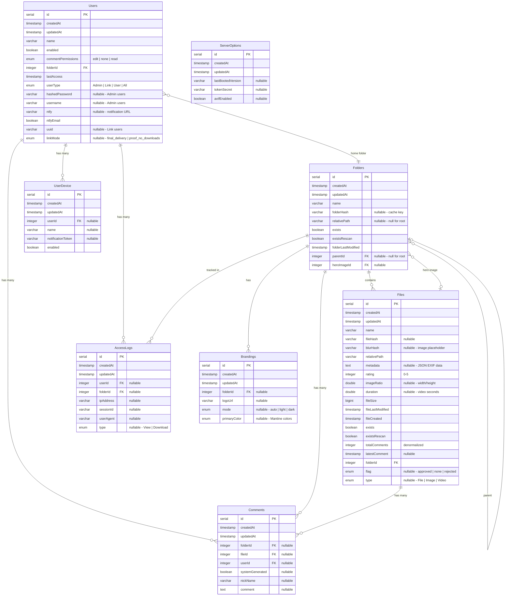

# Database Entity Relationship Diagram

This diagram shows the relationships between database tables in PICR.



## Table Purposes

| Table | Purpose |
|-------|---------|
| **Users** | Authentication & authorization. Admin users have username/password; Link users have UUID for public sharing. |
| **Folders** | Directory hierarchy mirroring filesystem. Self-referential for tree structure. |
| **Files** | Media files with extracted metadata. Discriminated by `type` (File/Image/Video). |
| **Comments** | User feedback on files, plus system-generated messages for workflows. |
| **AccessLogs** | Audit trail for views/downloads, primarily for Link user analytics. |
| **Brandings** | Per-folder theming for white-label public galleries. Cascades to subfolders. |
| **UserDevice** | Mobile app push notification registration. |
| **ServerOptions** | Singleton server config (JWT secret, feature flags). |

## Common Query Patterns

```typescript
// Get folder with files
const folder = await db.query.dbFolder.findFirst({
  where: eq(dbFolder.id, folderId),
  with: { files: true },
});

// Get user's accessible folders (uses picrDb.ts helpers)
const folder = await dbFolderForId(folderId); // throws if not found

// Check file exists and get it
const file = await dbFileForId(fileId); // throws if not found
```
