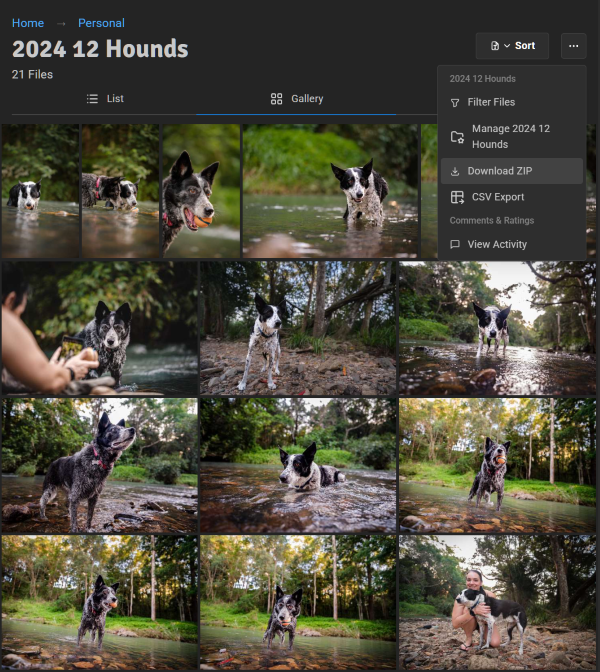
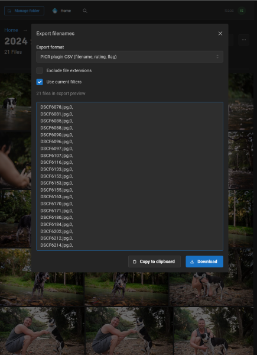
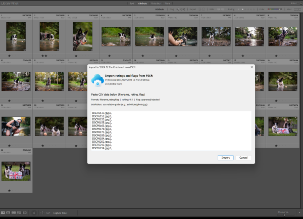

# Lightroom Plugin

PICR includes a free Lightroom Classic plugin that lets you import ratings and flags from PICR back into Lightroom.

This is useful when clients have reviewed and rated images in PICR - you can sync those ratings back to your Lightroom catalog without manually updating each photo.

## Installation

### Download

1. Go to the [Latest Lightroom Plugin Release](https://github.com/IsaacInsoll/PICR/releases/tag/lightroom-latest)
2. Download `picr-lightroom-v*.lrplugin.zip`
3. Extract the zip file

### Install in Lightroom

**Option A: Copy to Modules folder**

Copy the extracted `picr.lrplugin` folder to:
- **macOS**: `~/Library/Application Support/Adobe/Lightroom/Modules/`
- **Windows**: `C:\Users\<username>\AppData\Roaming\Adobe\Lightroom\Modules\`

Then restart Lightroom.

**Option B: Add via Plugin Manager**

1. In Lightroom, go to **File → Plug-in Manager**
2. Click **Add**
3. Navigate to the extracted `picr.lrplugin` folder
4. Click **Done**

## Usage

### Step 1: Export from PICR

1. In PICR, navigate to the folder you want to sync
2. Click the folder menu and select **CSV Export**
3. Configure the export options:
   - Format: **PICR plugin CSV**
   - Enable **Include subfolders** if needed
4. Click **Copy to clipboard**

### Step 2: Import in Lightroom

1. In Lightroom, select the **same folder** in the Library module
2. Go to **Library → Plug-in Extras → Import PICR Data**
3. Paste the CSV data into the text field
4. Click **Import**

### Step 3: Review Results

The plugin will show you:
- How many files were updated
- Any files that couldn't be found
- If all files were already up to date

## Features

### Ratings

PICR ratings (0-5 stars) are synced to Lightroom's star ratings.

| PICR | Lightroom |
|------|-----------|
| 0 stars | Unrated |
| 1-5 stars | 1-5 stars |

### Flags

PICR approval flags are synced to Lightroom's pick status.

| PICR Flag | Lightroom |
|-----------|-----------|
| Approved | Picked (white flag) |
| Rejected | Rejected (black X) |
| None | No change |

### Subfolders

When exporting from PICR with "Include subfolders" enabled, the plugin will match files in the corresponding Lightroom subfolders.

### Extension Matching

The plugin matches by filename without extension. This means:
- `photo.jpg` in PICR matches `photo.NEF` or `photo.CR2` in Lightroom
- Perfect for workflows where you export JPGs to PICR but keep RAW files in Lightroom

## Typical Workflow

1. **Export JPGs** from Lightroom to a folder
2. **Add folder** to PICR and share with client
3. **Client reviews** and rates/approves images in PICR
4. **Export CSV** from PICR
5. **Import to Lightroom** using the plugin
6. **Filter in Lightroom** by rating or flag to find approved images
7. **Continue editing** the selected images

## Troubleshooting

### "No files from the CSV were found"

- Make sure you have the correct folder selected in Lightroom
- Check that the folder structure matches (if using subfolders)
- Verify the files exist in your Lightroom catalog

### Files not matching

- The plugin strips file extensions before matching
- Virtual copies are supported (e.g., `photo-2.jpg` matches "Copy 1")
- Check for typos in filenames

### Plugin not appearing in menu

1. Go to **File → Plug-in Manager**
2. Find "PICR Lightroom Plugin" in the list
3. Make sure it shows as "Installed and running"
4. If not, try clicking **Reload Plug-in**

## Updates

To update the plugin:
1. Download the latest version from [GitHub Releases](https://github.com/IsaacInsoll/PICR/releases/tag/lightroom-latest)
2. Replace the `picr.lrplugin` folder with the new version
3. In Lightroom, go to **File → Plug-in Manager** and click **Reload Plug-in**
