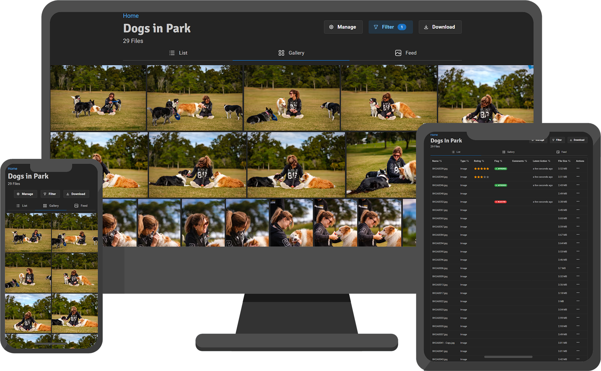

Picr is a self-hosted online image sharing tool for photographers to share photos with clients.

- 👩🏻‍💻 [GitHub](https://github.com/isaacinsoll/picr)
- 🐳 [Docker Hub](https://hub.docker.com/r/isaacinsoll/picr)
- 🔖 [Releases / Changelog](https://github.com/IsaacInsoll/PICR/releases)

## Features

- Cheaper storage: no need to pay for google drive / dropbox
- Better client experience: UI is tailored for clients receiving photo/video from you, rather than a generic shared folder
- Logging/Notifications of visits: know when your clients have viewed the data
- (optional) Ability for clients to rate / approve / comment on images
- Theming and branding
- English, French, and Greek web interface

## Manual

- [Installation Instructions](/PICR/getting-started/install/)
  Picr is typically installed using `docker`
- [PICR Ping](/PICR/operations/picr-ping/)
  Realtime media detection when PICR reads a library from a separate NAS.
- [Troubleshooting](/PICR/operations/troubleshooting/)
  Common issues and fixes, including thumbnail permission errors
- [Files and Folders](/PICR/galleries/files-and-folders/)
  How files and folders work and suggested workflows with multiple examples.
- [Users and Links](/PICR/sharing/users-and-links/)
  Explains how users (you) and public links (your clients) work with permissions. Also covers avatars
- [Comments, Ratings and Flags](/PICR/sharing/reviews/)
  You can allow users to comment, rate and flag individual files
- [Branding and Theming](/PICR/galleries/branding/)
  Customize fonts, colors, and themes for your galleries
- [Notifications](/PICR/sharing/notifications/)
  Receive notifications on your iOS / Android device when users access the folders or leave comments/ratings.
- [Lightroom Plugin](/PICR/integrations/lightroom/)
  Sync ratings and flags from PICR back to Lightroom Classic.
- [Languages](/PICR/reference/languages/)
  Supported languages, language selection, and the current translation scope.

## 🧑‍💻 Development

We'd love any help you can offer, including:

- Feature Development / Bugfixes (programming)
- Product Testing / QA (find and log bugs)
- Documentation (writing these instructions)

See the [Development Docs](https://github.com/IsaacInsoll/PICR/blob/master/docs/development/index.md) to get started.

## Licensing (human-friendly)

- PICR is source-available under the Business Source License 1.1 with a simple promise: anyone can self-host or run small paid hosting (up to ~$100k/year from PICR), but large cloud providers (AWS, GCP, Azure, Alibaba, Oracle, IBM, Tencent, etc.) cannot offer it as a managed service without a separate agreement.
- Each release automatically converts to GPLv3 after 4 years.
- See `LICENSE` for the legal text

## 🙏 Special Thanks

Thanks to:

- Monique for being the worlds greatest wife and putting up with all the time I spent on this 💖
- Mason D for providing a bunch of senior software engineering advice 🧔🏻‍♂️
