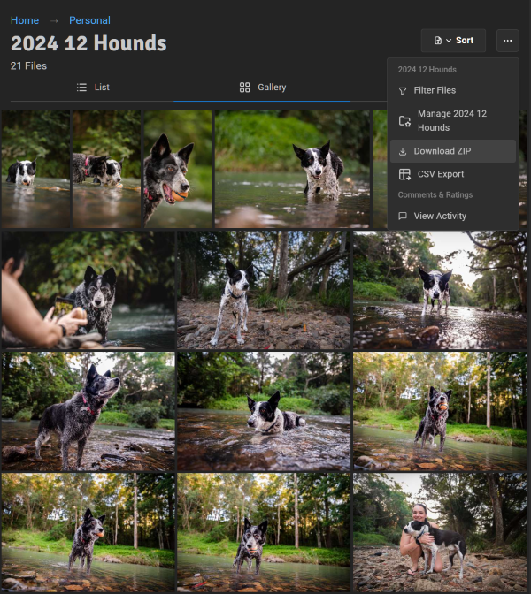
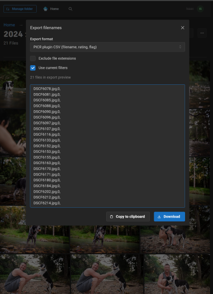
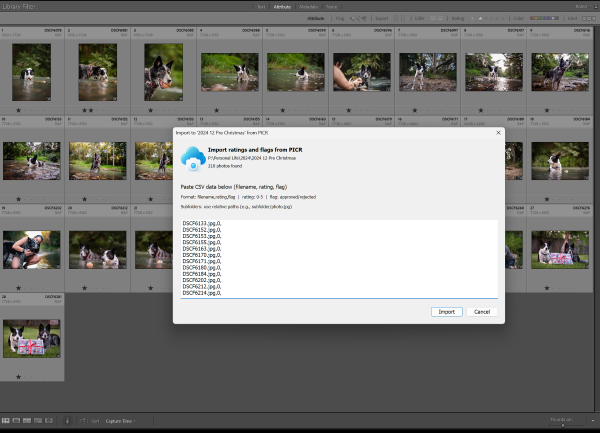

PICR includes a Lightroom Classic plugin that imports the current PICR ratings and approve/reject flags into matching Lightroom photos.

This is a manual CSV handoff, not a live connection between Lightroom and the PICR server. Comments are not imported.

## Download the matching plugin

The plugin is bundled with the running PICR version:

1. Open a folder as a signed-in PICR user.
2. Choose **CSV Export** from the folder menu.
3. Select **PICR plugin CSV**.
4. Select the **PICR Lightroom Plugin** download link.
5. Extract the downloaded ZIP.

Download a fresh copy after upgrading PICR so the plugin and exporter stay aligned.

## Install in Lightroom Classic

### Add through Plug-in Manager

1. In Lightroom Classic, choose **File → Plug-in Manager**.
2. Select **Add**.
3. Choose the extracted `picr.lrplugin` folder.
4. Confirm that it appears as installed and running.

### Or copy to the Modules folder

Copy `picr.lrplugin` to:

- macOS: `~/Library/Application Support/Adobe/Lightroom/Modules/`
- Windows: `C:\Users\<username>\AppData\Roaming\Adobe\Lightroom\Modules\`

Restart Lightroom Classic after copying it manually.

## Export a reviewed selection from PICR

1. Open the reviewed folder in PICR.
2. Apply any rating, flag, filename, or metadata filters you want the export to follow.
3. Choose **CSV Export**.
4. Select **PICR plugin CSV**.
5. Keep **Use current filters** enabled to export only the visible selection, or disable it for every file in the folder.
6. Enable **Include subfolders** when the Lightroom folder tree matches the PICR tree.
7. Copy the generated data to the clipboard.




The PICR format has no header row. Each line contains a filename, rating, and flag.

When subfolders are included, paths are relative to the selected PICR folder. PICR reports if a very large recursive export is truncated; narrow the folder or filters before importing an incomplete selection.

## Import into Lightroom Classic

1. In Lightroom's Library module, select the folder corresponding to the PICR export root.
2. Choose **Library → Plug-in Extras → Import PICR Data**.
3. Paste the CSV data.
4. Select **Import**.



The result reports updated photos, unchanged photos, and paths that could not be matched.

## Rating and flag mapping

| PICR value         | Lightroom value                    |
| ------------------ | ---------------------------------- |
| 0 stars            | Unrated                            |
| 1–5 stars          | 1–5 stars                          |
| Approved           | Picked/white flag                  |
| Rejected           | Rejected/black flag                |
| No PICR flag value | Leave the Lightroom flag unchanged |

:::caution[Back up the Lightroom catalog before importing]
The import changes matching Lightroom catalog metadata. Make a Lightroom catalog backup before a large or unfamiliar import.
:::

## Filename matching

The plugin strips the extension before matching. This supports a common proofing workflow:

```text title="Proof-to-original filename matching"
PICR proof: IMG_0001.jpg
Lightroom original: IMG_0001.CR3
```

Subfolder exports include their relative path so identical basenames in different folders can still match the intended location.

Lightroom virtual copies are represented using the plugin's copy-name convention; for example, `photo-2.jpg` can match Lightroom's first virtual copy of `photo`.

## Recommended workflow

1. Export JPEG proofs from Lightroom into a PICR folder.
2. Create a proofs-only public link with **Edit** review permission.
3. Ask the recipient to use either ratings or approve/reject flags consistently.
4. Filter and inspect the completed selection in PICR.
5. Export PICR plugin CSV.
6. Select the matching Lightroom folder and import the data.
7. Filter the Lightroom catalog by the imported rating or flag.
8. Finish editing and publish a separate final-delivery gallery.

## Troubleshooting

### No files were found

- Confirm the selected Lightroom folder corresponds to the PICR export root.
- If the PICR export includes subfolders, confirm the relative folder structure also exists in the Lightroom catalog.
- Confirm the proof and original use the same basename before the extension.
- Look for renamed files, duplicate basenames, and unexpected virtual-copy suffixes.

### Some files were not found

Read the paths in the import result. Re-export a narrower folder or correct the folder/filename mismatch rather than manually altering a large CSV.

### Plugin does not appear

1. Open **File → Plug-in Manager**.
2. Confirm `PICR Lightroom Plugin` is listed and running.
3. Select **Reload Plug-in** after replacing it during a PICR upgrade.
4. If it is absent, add the extracted `picr.lrplugin` directory again.
