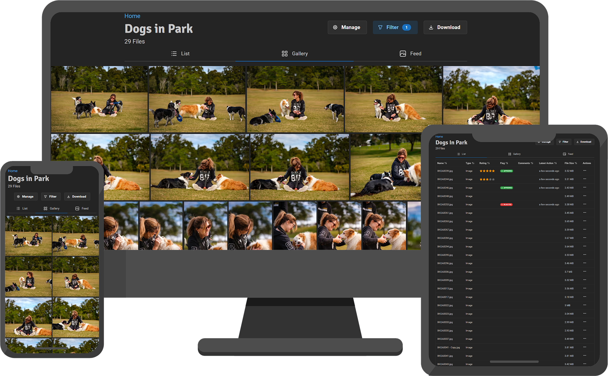

# Picr

### Self-hosted online image sharing tool for photographers to share photos with clients.

👩🏻‍💻 [GitHub](https://github.com/isaacinsoll/picr) | 🐳 [Docker Hub](https://hub.docker.com/r/isaacinsoll/picr) | 📱 [App Store](https://apps.apple.com/us/app/picr-client/id6748066012) | 📱 [Google Play](https://play.google.com/store/apps/details?id=com.isaacinsoll.picr) | 🔌 [Lightroom Plugin](https://isaacinsoll.github.io/PICR/lightroom-plugin.html)

📝 [Picr Manual](https://isaacinsoll.github.io/PICR/) for the full feature list and documentation

▶️ [Installation Instructions](https://isaacinsoll.github.io/PICR/install.html) for a sample `compose.yml` and instructions

🧑‍💻 [Development Docs](docs/development/index.md) if you want to contribute

