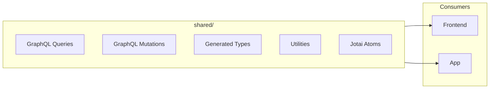

# Shared Module Development Guide

Code shared between `frontend` (React web) and `app` (React Native). Contains GraphQL operations, utilities, and types.

Originally everything was in `frontend`. Now that we have an `app` that is very similar (IE: client for the backend) we move stuff that is shared between both to `/shared`

EG: actual UI is different (web uses Mantine UI, app uses React Native components), but the business logic, queries etc are shared. 

## What This Module Does



## Directory Structure

```
shared/
├── gql/                    # Generated GraphQL types (DO NOT EDIT)
│   ├── graphql.ts          # All generated types
│   └── gql.ts              # TypedDocumentNode helpers
├── urql/
│   ├── queries/            # GraphQL query definitions
│   ├── mutations/          # GraphQL mutation definitions
│   ├── fragments/          # Reusable fragments
│   ├── urqlClient.tsx      # URQL client factory
│   ├── urqlCacheExchange.ts # Cache configuration
│   └── graphql.schema.json # Schema for cache validation
├── files/                  # File/folder utilities
├── search/                 # Search utilities
├── validation/             # Input validation
├── hooks/                  # Shared React hooks
├── helpers/                # General utilities
├── prettyBytes.ts          # File size formatting
├── prettyDate.ts           # Date formatting
├── pluralize.ts            # Pluralization
└── package.json
```

## What CAN and CANNOT Be Shared

### Safe to Share

| Type | Examples | Why Safe |
|------|----------|----------|
| GraphQL operations | Queries, mutations, fragments | Plain strings + types |
| Generated types | `File`, `Folder`, `User` | Pure TypeScript |
| Pure functions | `prettyBytes`, `sortFiles` | No React dependencies |
| Jotai atoms | `filterAtom` | Framework-agnostic |
| Constants | `thumbnailDimensions` | Plain values |
| Validation | `validateFolderName` | Pure functions |

### NOT Safe to Share

| Type | Why Not | Workaround |
|------|---------|------------|
| URQL hooks | Different instances per app | Use hooks in consumer |
| React components | Web vs Native components | Duplicate or abstract |
| Platform-specific code | iOS/Android/Web differences | Keep in consumer |

### The Core Constraint

```
Frontend: React 19.1 + URQL 4.2
App:      React 19.1 + URQL 4.2
Shared:   React 19.0 (exact) + URQL peer dependency
```

Different URQL instances cause hook errors. The solution: define operations in shared, use hooks in consumers.

## GraphQL Operations

### Query Pattern

```typescript
// shared/urql/queries/viewFolderQuery.ts
import { gql } from '../gql.js';

export const viewFolderQuery = gql(`
  query ViewFolder($folderId: ID!) {
    folder(id: $folderId) {
      ...FolderFragment
      files {
        ...FileFragment
      }
    }
  }
`);
```

### Mutation Pattern

```typescript
// shared/urql/mutations/addCommentMutation.ts
import { gql } from '../gql.js';

export const addCommentMutation = gql(`
  mutation AddComment($fileId: ID!, $comment: String, $rating: Int, $flag: FileFlag) {
    addComment(id: $fileId, comment: $comment, rating: $rating, flag: $flag) {
      id
      rating
      flag
      totalComments
    }
  }
`);
```

### Fragment Pattern

```typescript
// shared/urql/fragments/fileFragment.ts
import { gql } from '../gql.js';

export const fileFragment = gql(`
  fragment FileFragment on FileInterface {
    id
    name
    type
    fileHash
    rating
    flag
    ... on Image {
      imageRatio
      blurHash
      metadata { camera lens aperture }
    }
    ... on Video {
      duration
      metadata { bitrate videoCodec }
    }
  }
`);
```

## URQL Client Configuration

### Client Factory

```typescript
// shared/urql/urqlClient.tsx
export const picrUrqlClient = (url: string, headers: HeadersInit) => {
  return new Client({
    url: url + 'graphql',
    suspense: true,
    exchanges: [urqlCacheExchange, retry, fetchExchange],
    fetchOptions: () => ({ headers }),
  });
};
```

### Cache Exchange

```typescript
// shared/urql/urqlCacheExchange.ts
export const urqlCacheExchange = cacheExchange({
  schema,
  keys: {
    // Non-normalizable types (return null for no caching)
    ImageMetadataSummary: () => null,
    VideoMetadataSummary: () => null,
    Task: () => null,
  },
  updates: {
    Mutation: {
      // Auto-invalidate queries after mutations
      editUser: (_, args, cache) => invalidateQueries(cache, ['folder']),
      addComment: (_, args, cache) => invalidateQueries(cache, ['comments']),
      editBranding: (_, args, cache) => invalidateQueries(cache, ['brandings', 'folder']),
    },
  },
});
```

## Utility Functions

### File Utilities (`files/`)

```typescript
// Sort files
import { sortFolderContents, SortType } from '@shared/files/sortFiles';
const sorted = sortFolderContents(folder, SortType.LastModified, 'desc');

// Filter files
import { filterFiles } from '@shared/files/filterFiles';
const filtered = filterFiles(files, { rating: 5, flag: 'approved' });

// Type guards
import { isImage, isVideo, isFolder } from '@shared/files/fileProps';
if (isImage(file)) {
  console.log(file.imageRatio);
}
```

### Formatting Utilities

```typescript
// File sizes
import { prettyBytes } from '@shared/prettyBytes';
prettyBytes(1048576); // "1 MB"

// Dates
import { prettyDate } from '@shared/prettyDate';
prettyDate('2024-01-15T10:30:00Z'); // "January 15th 2024, 10:30:00 am"

// Pluralization
import { pluralize } from '@shared/pluralize';
pluralize(5, 'photo'); // "5 photos"
```

### Validation

```typescript
import { validateFolderName, validateRelativePath } from '@shared/validation/folderPath';

// Single folder name
const error = validateFolderName('New Folder'); // null if valid

// Full path
const error = validateRelativePath('Parent/Child/Folder'); // null if valid
```

## Jotai Atoms

```typescript
// shared/filterAtom.ts
import { atom } from 'jotai';

export const filterAtom = atom(false);
export const filterOptions = atom<FilterOptions>(defaultFilterOptions);
export const totalFilterOptionsSelected = atom((get) => {
  const options = get(filterOptions);
  // Count active filters
  return Object.values(options).filter(Boolean).length;
});
```

Usage in consumers:
```typescript
import { useAtom } from 'jotai';
import { filterAtom } from '@shared/filterAtom';

const [isFiltering, setIsFiltering] = useAtom(filterAtom);
```

## Adding a New Query

1. Create file in `shared/urql/queries/`:
   ```typescript
   // shared/urql/queries/myNewQuery.ts
   import { gql } from '../gql.js';

   export const myNewQuery = gql(`
     query MyNewQuery($param: ID!) {
       myField(id: $param) {
         id
         name
       }
     }
   `);
   ```

2. Regenerate types:
   ```bash
   npm run gql
   ```

3. Use in consumer:
   ```typescript
   // In frontend or app
   import { useQuery } from 'urql';
   import { myNewQuery } from '@shared/urql/queries/myNewQuery';

   const [result] = useQuery({ query: myNewQuery, variables: { param: '123' } });
   ```

## Adding a New Utility

1. Create file in appropriate location:
   ```typescript
   // shared/helpers/myUtility.ts
   export function myUtility(input: string): string {
     return input.toUpperCase();
   }
   ```

2. Ensure it's a pure function (no React, no platform-specific code)

3. Export from barrel if needed

4. Use in consumers:
   ```typescript
   import { myUtility } from '@shared/helpers/myUtility';
   ```

## Code Generation

The `gql/` directory is auto-generated by `npm run gql`. This runs GraphQL codegen which:

1. Introspects the running backend at `http://localhost:6900/graphql`
2. Generates TypeScript types from schema
3. Creates typed document nodes for all operations
4. Updates `graphql.schema.json` for cache validation

**Never edit files in `gql/` directly** - they will be overwritten.

## Troubleshooting

### Import not found

1. Check path alias is configured in consumer's `tsconfig.json`:
   ```json
   {
     "paths": {
       "@shared/*": ["../shared/*"]
     }
   }
   ```

2. For app, check `metro.config.js` has the path

### Type errors after schema change

```bash
# Regenerate types
npm run gql

# May need backend running
npm run start:server
```

### "useEffect on null" in app

This usually means a React hook is being imported from shared. Move the hook to `app/src/app-shared/` or use it only in the consumer.

### Cache not updating

1. Check mutation is in `urqlCacheExchange.ts` updates
2. Check correct query names are being invalidated
3. Try manual invalidation:
   ```typescript
   import { invalidateQueries } from '@shared/urql/invalidateQueries';
   invalidateQueries(cache, ['myQuery']);
   ```
