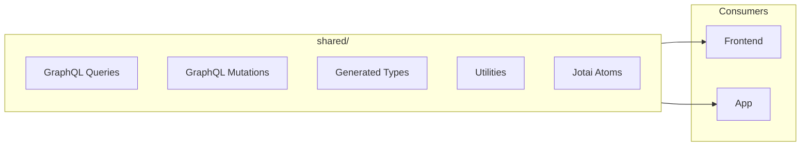

# Shared Module Development Guide

Code shared between `frontend` (React web) and `app` (React Native). Contains GraphQL operations, utilities, and types.

Originally everything was in `frontend`. Now that we have an `app` that is very similar (IE: client for the backend) we move stuff that is shared between both to `/shared`

EG: actual UI is different (web uses Mantine UI, app uses React Native components), but the business logic, queries etc are shared.

## What This Module Does


```mermaid
flowchart LR
    subgraph shared["shared/"]
        Q[GraphQL Queries]
        M[GraphQL Mutations]
        T[Generated Types]
        U[Utilities]
        A[Jotai Atoms]
    end

    subgraph consumers["Consumers"]
        FE[Frontend]
        APP[App]
    end

    shared --> FE
    shared --> APP
```

## Directory Structure

```
shared/
├── gql/                    # Generated GraphQL types (DO NOT EDIT)
│   ├── graphql.ts          # All generated types
│   └── gql.ts              # TypedDocumentNode helpers
├── urql/
│   ├── queries/            # GraphQL query definitions
│   ├── mutations/          # GraphQL mutation definitions
│   ├── fragments/          # Reusable fragments
│   ├── urqlClient.tsx      # URQL client factory
│   ├── urqlCacheExchange.ts # Cache configuration
│   └── graphql.schema.json # Schema for cache validation
├── branding/               # Branding system constants and types
│   ├── galleryPresets.ts   # Thumbnail size/spacing/radius/font-size presets + defaults
│   ├── socialLinkTypes.ts  # SocialLink type, SOCIAL_LINK_TYPES list, detectSocialLinkType()
│   └── fontRegistry.ts     # HeadingFontKey enum mapping and normalization helpers
├── files/                  # File/folder utilities
│   ├── sortFiles.ts        # ViewFolder types, sortFolderContents, isBannerImage/isHeroImage flags
│   └── folderContentsViewModel.ts  # FolderContentsItem, folderContentsItems()
├── search/                 # Search utilities
├── i18n/                   # Locale resolution, catalogs, and Intl helpers
├── validation/             # Input validation
├── hooks/                  # Shared React hooks
├── helpers/                # General utilities
├── prettyBytes.ts          # File size formatting
├── prettyDate.ts           # Date formatting
└── package.json
```

## What CAN and CANNOT Be Shared

### Safe to Share

| Type               | Examples                      | Why Safe              |
| ------------------ | ----------------------------- | --------------------- |
| GraphQL operations | Queries, mutations, fragments | Plain strings + types |
| Generated types    | `File`, `Folder`, `User`      | Pure TypeScript       |
| Pure functions     | `prettyBytes`, `sortFiles`    | No React dependencies |
| Jotai atoms        | `filterAtom`                  | Framework-agnostic    |
| Constants          | `thumbnailDimensions`         | Plain values          |
| Format helpers     | `imageFormats`                | Pure extension checks |
| Validation         | `validateFolderName`          | Pure functions        |

### NOT Safe to Share

| Type                   | Why Not                     | Workaround            |
| ---------------------- | --------------------------- | --------------------- |
| URQL hooks             | Different instances per app | Use hooks in consumer |
| React components       | Web vs Native components    | Duplicate or abstract |
| Platform-specific code | iOS/Android/Web differences | Keep in consumer      |

### The Core Constraint

```
Frontend: React 19.1 + URQL 4.2
App:      React 19.1 + URQL 4.2
Shared:   React 19.0 (exact) + URQL peer dependency
```

Different URQL instances cause hook errors. The solution: define operations in shared, use hooks in consumers.

## Image Format Helpers

`shared/imageFormats.ts` owns pure extension-based media format groups used by
backend, frontend, and app. Keep runtime capability checks out of shared; the
backend combines these lists with `picrConfig.mediaCaps` because ImageMagick and
ExifTool availability depends on the server environment. Browser-displayable
originals are a narrower set than sharp-readable inputs: TIFF is sharp-readable
but should not be handed to a browser lightbox as a raw `` source.

## Auth Error Contract

Auth error metadata is shared across backend, frontend, and app:

- Registry file: `shared/auth/authErrorContract.ts`
- Contains canonical auth reason values, default messages, GraphQL `extensions.code` mapping, and global action hints
- Backend should throw auth errors using this registry (via `doAuthError`)
- Frontend/app classifiers should consume these shared constants instead of hardcoded strings

## GraphQL Operations

### Query Pattern

```typescript
// shared/urql/queries/viewFolderQuery.ts
import { gql } from '../gql.js';

export const viewFolderQuery = gql(`
  query ViewFolder($folderId: ID!) {
    folder(id: $folderId) {
      ...FolderFragment
      files {
        ...FileFragment
      }
    }
  }
`);
```

### Mutation Pattern

```typescript
// shared/urql/mutations/addCommentMutation.ts
import { gql } from '../gql.js';

export const addCommentMutation = gql(`
  mutation AddComment($fileId: ID!, $comment: String, $rating: Int, $flag: FileFlag) {
    addComment(id: $fileId, comment: $comment, rating: $rating, flag: $flag) {
      id
      rating
      flag
      totalComments
    }
  }
`);
```

### Fragment Pattern

```typescript
// shared/urql/fragments/fileFragment.ts
import { gql } from '../gql.js';

export const fileFragment = gql(`
  fragment FileFragment on FileInterface {
    id
    name
    type
    fileHash
    rating
    flag
    ... on Image {
      imageRatio
      blurHash
      metadata { camera lens aperture }
    }
    ... on Video {
      duration
      metadata { bitrate videoCodec }
    }
  }
`);
```

## URQL Client Configuration

### Client Factory

```typescript
// shared/urql/urqlClient.tsx
export const picrUrqlClient = (url: string, headers: HeadersInit) => {
  return new Client({
    url: url + 'graphql',
    suspense: true,
    exchanges: [urqlCacheExchange, retry, fetchExchange],
    fetchOptions: () => ({ headers }),
  });
};
```

### Cache Exchange

```typescript
// shared/urql/urqlCacheExchange.ts
export const urqlCacheExchange = cacheExchange({
  schema,
  keys: {
    // Non-normalizable types (return null for no caching)
    ImageMetadataSummary: () => null,
    VideoMetadataSummary: () => null,
    Task: () => null,
  },
  updates: {
    Mutation: {
      // Auto-invalidate queries after mutations
      editUser: (_, args, cache) =>
        invalidateQueries(cache, ['folder', 'users']),
      addComment: (_, args, cache) => invalidateQueries(cache, ['comments']),
      editBranding: (_, args, cache) =>
        invalidateQueries(cache, ['brandings', 'folder']),
    },
  },
});
```

Public links are users: `editUser` must invalidate `users` as well as `folder`,
because public-link management and recent-client views read `Query.users` lists
and graphcache will not add a newly-created `User` entity to those lists
automatically.

## Utility Functions

### File Utilities (`files/`)

```typescript
// Sort files
import { sortFolderContents, SortType } from '@shared/files/sortFiles';
const sorted = sortFolderContents(folder, SortType.LastModified, 'desc');

// Filter files
import { filterFiles } from '@shared/files/filterFiles';
const filtered = filterFiles(files, { rating: 5, flag: 'approved' });

// Type guards
import { isImage, isVideo, isFolder } from '@shared/files/fileProps';
if (isImage(file)) {
  console.log(file.imageRatio);
}
```

### Formatting Utilities

```typescript
// File sizes. Use the structured result when a visualization needs the number
// and unit separately; do not parse the localized display string.
import { formatBytes } from '@shared/i18n/formatting';
formatBytes(1048576, 'fr').formatted; // "1,05 MB"
formatBytes(1048576, 'fr').value; // 1.05

// Dates
import { prettyDate } from '@shared/prettyDate';
prettyDate('2024-01-15T10:30:00Z', 'fr');
```

Shared formatting helpers are pure and default to English for app/backend
callers that do not yet have a language context. Frontend callers must pass
`useLanguage().formattingLocale` for numbers and absolute dates. Relative-time
output is translated prose and must follow the catalog language. UI plurals
belong in i18next catalogs with a numeric `count`; do not add another shared
English-only pluralizer.

Fallback strings inside these pure helpers default to English for app
compatibility. A caller with a translator should pass the localized label (for
example, `t('date.invalid')`) explicitly. Do not import
`shared/i18n/resources` from a formatting helper: that would pull every catalog
into untranslated app consumers and prevent catalog loading from becoming lazy
at the frontend bootstrap later.

#### Group quantities, not technical specs

Localize every number, but only apply digit grouping when the value is a
quantity a reader scans for magnitude. Values that are technical notation are
localized (decimal comma in French) but never grouped, because that is how every
other tool in this space writes them:

| Group (`useGrouping` default)     | Never group (`useGrouping: false`)             |
| --------------------------------- | ---------------------------------------------- |
| Dashboard totals ("12,483 files") | Shutter denominators — `1/8000`, not `1/8,000` |
| Byte counts via `formatBytes`     | Pixel dimensions — `6000 × 4000 px`            |
|                                   | ISO, focal lengths, years, ports, identifiers  |

Grouping separators exist to help judge magnitude. A shutter denominator is a
token from a small memorized set, and pixel dimensions are pattern-matched as a
shape, so separators only add noise — and in French they collide with the space
already delimiting `×` (`6 000 × 4 000`). Keeping the EXIF panel consistent
matters too: ISO renders ungrouped today, so grouping its neighbours looks wrong.

#### Relative import extensions are consumer-specific

There is no single specifier style that works everywhere, so the style a shared
module uses depends on who imports it **at runtime**:

| Consumer             | Runtime relative imports | Why                                                                           |
| -------------------- | ------------------------ | ----------------------------------------------------------------------------- |
| `app` (Expo/Metro)   | extensionless — `'./x'`  | Metro consumes the TypeScript source and will not map `./x.js` back to `x.ts` |
| `backend` (Node ESM) | explicit — `'./x.js'`    | `backend/tsconfig.json` uses `module: NodeNext`, which requires the extension |
| `frontend` (Vite)    | either                   | The bundler resolves both                                                     |

Type-only imports are erased before any consumer sees them, so `.js` is always
fine there.

**This is a property of a module's transitive import graph, not of its
directory.** Two files in the same folder can legitimately differ:

```ts
// shared/urql/mutations/addCommentMutation.ts   — imported by app and frontend
import { gql } from '../gql';
// shared/urql/mutations/deleteUserMutation.ts   — imported by frontend only
import { gql } from '../gql.js';
```

Both are correct. Do not "fix" either to match the other, and do not assume a
directory is uniformly one style.

When you change a shared runtime import graph, check every consumer that can
reach the changed module and validate each one — `cd backend && npx tsc --noEmit`
for Node, and an actual `npx expo export` for Metro, since lint and Vite builds
pass either way.

A backend violation surfaces as a NodeNext extension error at type-check rather
than a runtime failure, so it is caught — but the error appears inside a
`shared/` file and reads confusingly, which is why reachability is worth
checking first.

If a module genuinely has to serve both `app` and `backend` at runtime, that is
an unsolved case in this repo. Investigate and verify a project-wide approach
against both Metro resolution and backend emit before prescribing one; do not
adopt a solution that has only been reasoned about.

### Validation

```typescript
import {
  validateFolderName,
  validateRelativePath,
} from '@shared/validation/folderPath';

// Single folder name
const error = validateFolderName('New Folder'); // null if valid

// Full path
const error = validateRelativePath('Parent/Child/Folder'); // null if valid
```

## Jotai Atoms

```typescript
// shared/filterAtom.ts
import { atom } from 'jotai';

export const filterAtom = atom(false);
export const filterOptions = atom<FilterOptions>(defaultFilterOptions);
export const totalFilterOptionsSelected = atom((get) => {
  const options = get(filterOptions);
  // Count active filters
  return Object.values(options).filter(Boolean).length;
});
```

Usage in consumers:

```typescript
import { useAtom } from 'jotai';
import { filterAtom } from '@shared/filterAtom';

const [isFiltering, setIsFiltering] = useAtom(filterAtom);
```

## Adding a New Query

1. Create file in `shared/urql/queries/`:

   ```typescript
   // shared/urql/queries/myNewQuery.ts
   import { gql } from '../gql.js';

   export const myNewQuery = gql(`
     query MyNewQuery($param: ID!) {
       myField(id: $param) {
         id
         name
       }
     }
   `);
   ```

2. Regenerate types:

   ```bash
   npm run gql
   ```

3. Use in consumer:

   ```typescript
   // In frontend or app
   import { useQuery } from 'urql';
   import { myNewQuery } from '@shared/urql/queries/myNewQuery';

   const [result] = useQuery({
     query: myNewQuery,
     variables: { param: '123' },
   });
   ```

## Adding a New Utility

1. Create file in appropriate location:

   ```typescript
   // shared/helpers/myUtility.ts
   export function myUtility(input: string): string {
     return input.toUpperCase();
   }
   ```

2. Ensure it's a pure function (no React, no platform-specific code)

3. Export from barrel if needed

4. Use in consumers:
   ```typescript
   import { myUtility } from '@shared/helpers/myUtility';
   ```

## Code Generation

The `gql/` directory is auto-generated by `npm run gql`. This runs GraphQL codegen which:

1. Introspects the running backend at `http://localhost:6900/graphql`
2. Generates TypeScript types from schema
3. Creates typed document nodes for all operations
4. Updates `graphql.schema.json` for cache validation

**Never edit files in `gql/` directly** - they will be overwritten.

## Font System (`branding/`)

The font system provides custom heading fonts for gallery branding. Fonts are defined once in `shared/branding/fontRegistry.ts` and code is generated for both frontend (CSS imports) and app (native font files).

### Architecture

```
shared/branding/fontRegistry.ts    <-- Single source of truth
         │
         ├── Frontend: fonts.generated.ts (CSS imports)
         └── App: fonts.generated.ts (require() statements)
```

### Adding a New Font

1. **Add to the registry** in `shared/branding/fontRegistry.ts`:

   ```typescript
   {
     key: 'my-new-font',           // URL-safe identifier
     label: 'My New Font',          // Display name
     category: 'sans',              // sans|serif|display|script|mono|accessibility
     weights: [400, 700],           // Available weights
     headingOnly: false,            // true = heading use only, false = can be used for body
     description: 'Brief description of the font style.',
     suitableFor: ['weddings', 'portraits'],  // Use case hints for UI
   },
   ```

2. **Add the fontsource package** (frontend only):

   ```bash
   cd frontend && npm install @fontsource/my-new-font
   ```

3. **Regenerate font files**:

   ```bash
   npx tsx scripts/generate-fonts.ts
   ```

   This downloads TTF files from Google Fonts for the app and generates import statements for the frontend.

4. **Regenerate GraphQL types**:

   ```bash
   npm run gql
   ```

5. **Test both platforms** - verify the font appears in the branding selector and renders correctly.

### Key Files

| File                                                 | Purpose                                         |
| ---------------------------------------------------- | ----------------------------------------------- |
| `shared/branding/fontRegistry.ts`                    | Font definitions, types, and validation         |
| `scripts/generate-fonts.ts`                          | Code generator for platform-specific font files |
| `frontend/src/fonts.generated.ts`                    | Generated CSS imports (DO NOT EDIT)             |
| `app/src/fonts.generated.ts`                         | Generated require() statements (DO NOT EDIT)    |
| `app/src/helpers/headingFont.ts`                     | App font loading and weight selection           |
| `app/src/components/FolderView/FolderViewShared.tsx` | Shared folder view components                   |

### How Font Selection Works

1. **Backend**: Stores `headingFontKey` string in `Brandings` table
2. **GraphQL**: Exposes as `HeadingFontKey` enum (camelCase values)
3. **Frontend**: Sets CSS variable `--picr-heading-font` on document root
4. **App**: Updates `headingFontKeyAtom` which triggers font loading via `loadHeadingFont()`

### Font Loading (App)

The app uses Expo's font loading system:

- Base fonts (Signika, Roboto) are loaded at startup in `ThemeProvider`
- Custom heading fonts are loaded on-demand when a folder with branding is viewed
- `Font.isLoaded()` prevents duplicate loading during hot reload

### Type Safety

The `FontKey` type is derived from the registry array:

```typescript
export type FontKey = (typeof fontRegistry)[number]['key'];
```

Adding a font to the array automatically updates the type - no manual sync needed.

## Troubleshooting

### Import not found

1. Check path alias is configured in consumer's `tsconfig.json`:

   ```json
   {
     "paths": {
       "@shared/*": ["../shared/*"]
     }
   }
   ```

2. For app, check `metro.config.js` has the path

### Type errors after schema change

```bash
# Regenerate types
npm run gql

# May need backend running
npm run start:server
```

## Validation Commands

Run these after shared changes:

```bash
cd shared && npm run lint
cd shared && npx tsc --noEmit
```

If shared changes affect frontend or app types, also run:

```bash
cd frontend && npx tsc --noEmit
cd app && npx tsc --noEmit
```

Also run repo-wide formatting checks:

```bash
npm run format:check
```

For test validation, ask the user to run:

```bash
npm run workflow
```

### "useEffect on null" in app

This usually means a React hook is being imported from shared. Move the hook to `app/src/app-shared/` or use it only in the consumer.

### Cache not updating

1. Check mutation is in `urqlCacheExchange.ts` updates
2. Check correct query names are being invalidated
3. Try manual invalidation:
   ```typescript
   import { invalidateQueries } from '@shared/urql/invalidateQueries';
   invalidateQueries(cache, ['myQuery']);
   ```
